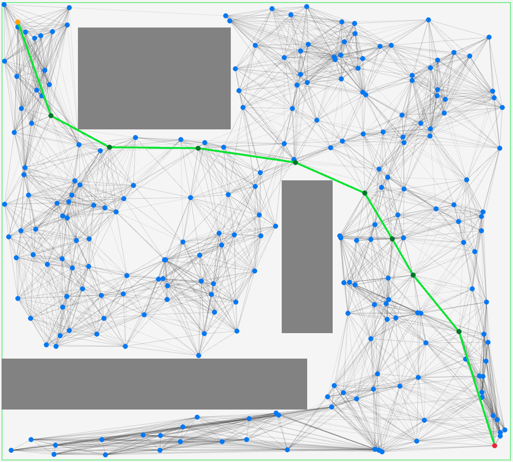
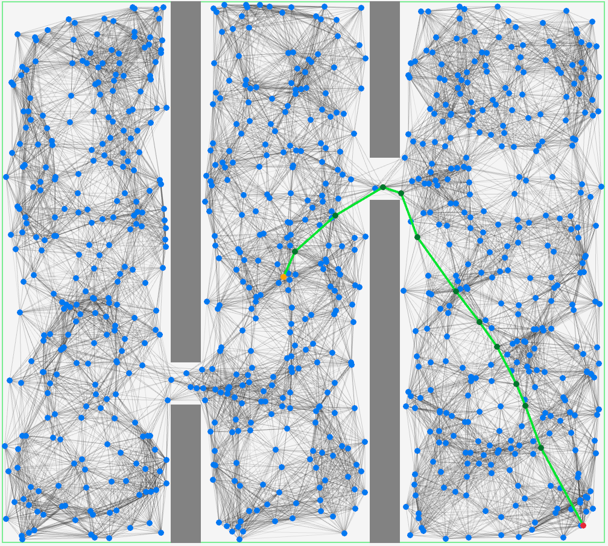
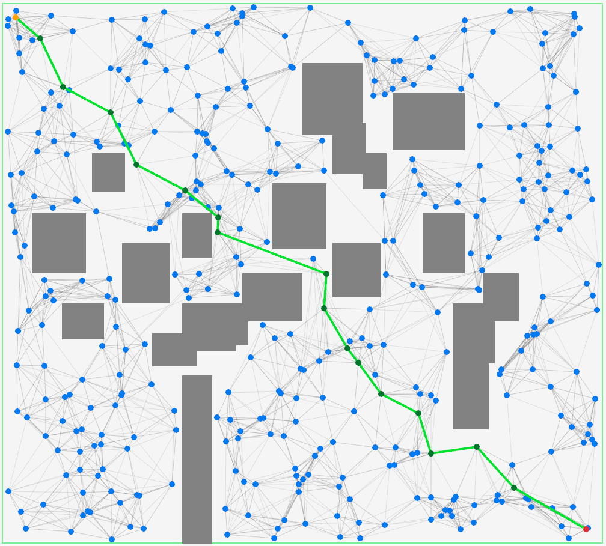

# Description

Áp dụng thuật toán PRM (Probabilistic Roadmap) kết hợp với thuật toán A* để tìm đường đi trong không gian 2D có chướng ngại vật

# Features

- Có thể đặt vị trí **điểm đầu** sử dụng `Z` và **điểm đích** sử dụng `X`
- Triển khai thuật toán PRM với các hàm kiểm tra va chạm và thuật toán tìm đường A* 
- Bật / Tắt đường đi sử dụng `UP_ARROW` 
- Reset bản đồ sử dụng `R`

# Examples

<p align="center">
  
</p>

<p align="center">
  
</p>

<p align="center">
  
</p>


https://github.com/user-attachments/assets/52b74aec-62e4-4774-a3b5-f8084d629dec


## How it works

- Sinh mẫu ngẫu nhiên trong không gian cấu hình và kiểm tra va chạm với chướng ngại vật 
- Kết nối các điểm lân cận sử dụng thuật toán KNN (K-nearest neighbors)
- Tìm đường đi ngắn nhất giữa điểm đầu và điểm đích sử dụng thuật toán A*

# Installation

## Dependencies

- **CMake**: Version 3.30+ ([website](https://cmake.org/))
- **Raylib**: Version 5.5 (Có thể cài qua [vcpkg](https://vcpkg.link/ports/raylib) hoặc cài [manually](https://www.raylib.com/))
- **C++ compiler**: GCC/g++, Clang, MSVC,...

### Build

```sh
git clone https://github.com/Enanann/Probabilistic-Roadmap.git

cd Probabilistic-Roadmap

cmake -B build # Use -DCMAKE_TOOLCHAIN_FILE=path/to/vcpkg.cmake if using vcpkg
cmake --build build --config Release
```

- Để có thể dễ dàng thử nghiệm mà không cần phải biên dịch mã nguồn, một **file `.exe`** được build cho **Windows** đã được cung cấp sẵn trong phần **Releases** của repository. (Đặt điểm đầu và đích trước khi nhập n và k để tránh tọa độ mặc định -1, -1)

- Các tệp bao gồm:
	- `pathplanning.exe`
	- `glfw3.dll`
	- `raylib.dll`


